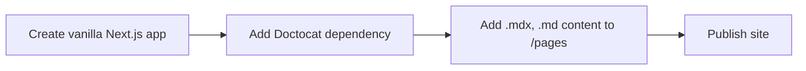

import {DoDontContainer, Do, Dont, Caption} from '@primer/doctocat-nextjs'

## Heading 2

Lorem ipsum dolor sit amet, consectetur adipiscing elit, sed do eiusmod tempor incididunt ut labore et dolore magna aliqua.
Ut enim ad minim veniam, quis nostrud exercitation ullamco laboris nisi ut aliquip ex ea commodo consequat.
Duis aute irure dolor in reprehenderit in voluptate velit esse cillum dolore eu fugiat nulla pariatur.
Excepteur sint occaecat cupidatat non proident, sunt in culpa qui officia deserunt mollit anim id est laborum.

- Vivamus eu risus nec lectus consequat rutrum at vel lacus.
- Donec at dolor ut metus imperdiet congue vel porta nunc.
- Quisque eu tortor suscipit, congue quam in, bibendum tellus.

### Heading level 3


Pellentesque non ornare ligula. Suspendisse nibh purus, pretium id tortor sit
amet, tincidunt gravida augue. Ut malesuada, nisl vel dignissim mollis.

#### Heading level 4

> A simple markdown quote

Secure code as you write it. Automatically review every change to your
codebase and identify vulnerabilities before they reach production.

##### Heading level 5

1. Vivamus eu risus nec lectus consequat rutrum at vel lacus.
2. Donec at dolor ut metus imperdiet congue vel porta nunc.
3. Quisque eu tortor suscipit, congue quam in, bibendum tellus.

###### Heading level 6

Lorem ipsum dolor sit amet, consectetur adipiscing elit, sed do eiusmod tempor incididunt ut labore et dolore magna aliqua. Ut enim ad minim veniam, quis nostrud exercitation ullamco laboris nisi ut aliquip ex ea commodo consequat.


---

###### Do's and Don'ts

<DoDontContainer stacked>
  <Do>
    
    <Caption>Example of what you should do</Caption>
  </Do>
  <Dont>
    
    <Caption>Example of what you shouldn't do</Caption>
  </Dont>
</DoDontContainer>

###### Code block w/ line selection

```js {3} filename="demo.js"
const a = 1

console.log(a)
```

###### Testimonials

<div>
  <figure>
    <blockquote>
      <span>This quote uses a HTML blockquote elements to wrap the quote.</span>
      <figcaption>
        <span>Lisa Vanderschuit, Engineering Program Manager, Shopify</span>
      </figcaption>
    </blockquote>
  </figure>
</div>

###### Mermaid diagrams


