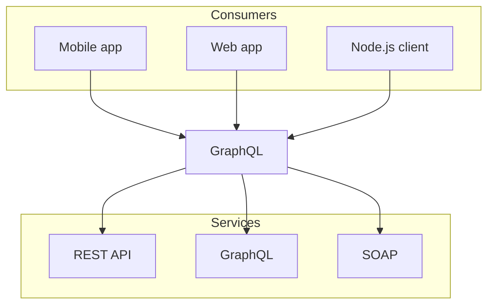

# Demo page

## Heading level 2

Lorem ipsum dolor sit amet, consectetur adipiscing elit. Ut tempor lectus
ipsum, consectetur convallis diam pretium quis. Proin ut felis ut eros
tristique tincidunt.

<figure>
  <blockquote>
    Nulla ac odio eu magna hendrerit porta. Donec nec eros quis tortor tincidunt
    vulputate. Aenean id pharetra diam, sit amet auctor leo. Aliquam erat
    volutpat.
    <figcaption>
      Lisa Vanderschuit, Engineering Program Manager, Shopify
    </figcaption>
  </blockquote>
</figure>

Integer pellentesque pretium nulla viverra molestie. Praesent quis pretium
sapien. Sed convallis eget lectus et pulvinar:

- Vivamus eu risus nec lectus consequat rutrum at vel lacus.
- Donec at dolor ut metus imperdiet congue vel porta nunc.
- Quisque eu tortor suscipit, congue quam in, bibendum tellus.

### Heading level 3

Pellentesque non ornare ligula. Suspendisse nibh purus, pretium id tortor sit
amet, tincidunt gravida augue. Ut malesuada, nisl vel dignissim mollis


#### Heading level 4

Secure code as you write it. Automatically review every change to your
codebase and identify vulnerabilities before they reach production.

<a href="/#">Learn more here.</a>

##### Heading level 5

1. Vivamus eu risus nec lectus consequat rutrum at vel lacus.
2. Donec at dolor ut metus imperdiet congue vel porta nunc.
3. Quisque eu tortor suscipit, congue quam in, bibendum tellus.

###### Heading level 6

Pellentesque non ornare ligula. Suspendisse nibh purus, pretium id tortor sit
amet, tincidunt gravida augue.

<code>for-each-ref</code> is extremely useful for listing references, finding which
references point at a given object (with <code>--points-at</code>), which
references have been merged into a given branch (with <code>--merged</code>), or
which references contain a given commit (with <code>--contains</code>).

Nunc velit odio, posuere eu felis eget, consectetur fermentum nisi. Aenean
tempor odio id ornare ultrices. Quisque blandit condimentum tellus, semper
efficitur sapien dapibus nec.

##### Code block w/ line selection

```js filename="demo.js" {3}
let a = 1;

console.log(a);
```

##### Mermaid diagrams


