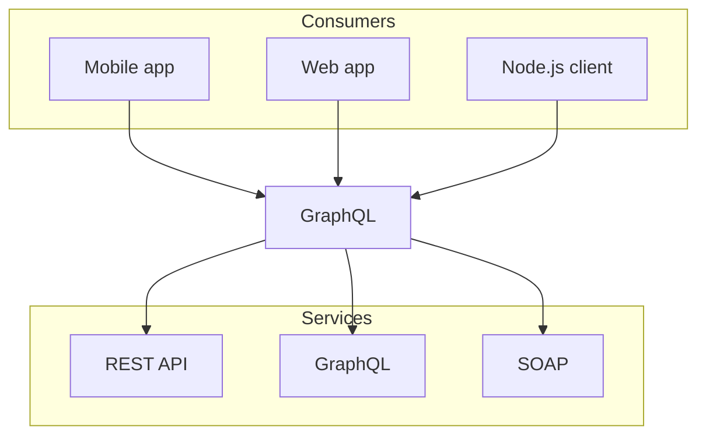

import {DoDontContainer, Do, Dont} from '../@primer-nextocat/components/dos-and-donts/DosAndDonts'
import {Caption} from '../@primer-nextocat/components/caption/Caption'

## Heading level 2

Lorem ipsum dolor sit amet, consectetur adipiscing elit. Ut tempor lectus
ipsum, consectetur convallis diam pretium quis. Proin ut felis ut eros
tristique tincidunt.

<div>
  <figure>
    <blockquote>
      <span>
        Nulla ac odio eu magna hendrerit porta. Donec nec eros quis tortor tincidunt vulputate. Aenean id pharetra diam,
        sit amet auctor leo. Aliquam erat volutpat.
      </span>
      <figcaption>
        <span>Lisa Vanderschuit, Engineering Program Manager, Shopify</span>
      </figcaption>
    </blockquote>
  </figure>
</div>

Integer pellentesque pretium nulla viverra molestie. Praesent quis pretium
sapien. Sed convallis eget lectus et pulvinar:

- Vivamus eu risus nec lectus consequat rutrum at vel lacus.
- Donec at dolor ut metus imperdiet congue vel porta nunc.
- Quisque eu tortor suscipit, congue quam in, bibendum tellus.

### Heading level 3

Pellentesque non ornare ligula. Suspendisse nibh purus, pretium id tortor sit
amet, tincidunt gravida augue. Ut malesuada, nisl vel dignissim mollis


#### Heading level 4

Secure code as you write it. Automatically review every change to your
codebase and identify vulnerabilities before they reach production.

<a href="/#">Learn more here.</a>

##### Heading level 5

1. Vivamus eu risus nec lectus consequat rutrum at vel lacus.
2. Donec at dolor ut metus imperdiet congue vel porta nunc.
3. Quisque eu tortor suscipit, congue quam in, bibendum tellus.

###### Heading level 6

Pellentesque non ornare ligula. Suspendisse nibh purus, pretium id tortor sit
amet, tincidunt gravida augue.

<code>for-each-ref</code> is extremely useful for listing references, finding which references point at a given object ),
which references have been merged into a given branch

Nunc velit odio, posuere eu felis eget, consectetur fermentum nisi. Aenean
tempor odio id ornare ultrices. Quisque blandit condimentum tellus, semper
efficitur sapien dapibus nec.

## Do's and Don'ts example


Buttons allow users to initiate an action or command when clicked. The button's label or text description indicates the purpose of the action to the user. Most of the time, we use the "Default" button type, but other types of buttons may be used to indicate something special about the button's hierarchy or functionality.

<DoDontContainer>
  <Do>
    
    <Caption>Keep button labels succinct with no line breaks.</Caption>
  </Do>
  <Dont>
    
    <Caption>Buttons should never contain line breaks and lose their button shape.</Caption>
  </Dont>
</DoDontContainer>

<DoDontContainer>
  <Do>
    
    <Caption>Show focus styles on keyboard :focus</Caption>
  </Do>
  <Dont>
    
    <Caption>Don't remove default button :focus styles.</Caption>
  </Dont>
</DoDontContainer>

<DoDontContainer>
  <Do>
    
    <Caption>Use sentence case for labels.</Caption>
  </Do>
  <Dont>
    
    <Caption>Don't use all-caps or other text formats.</Caption>
  </Dont>
</DoDontContainer>

### Code block w/ line selection

```js {3} filename="demo.js"
let a = 1

console.log(a)
```

##### Mermaid diagrams


